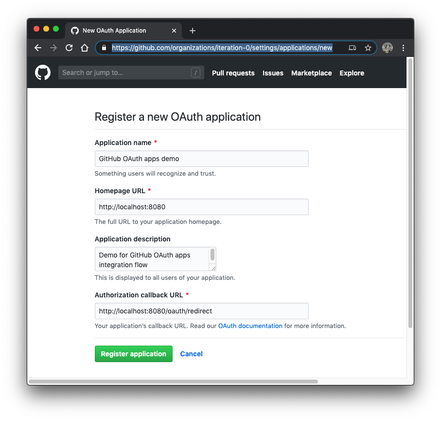
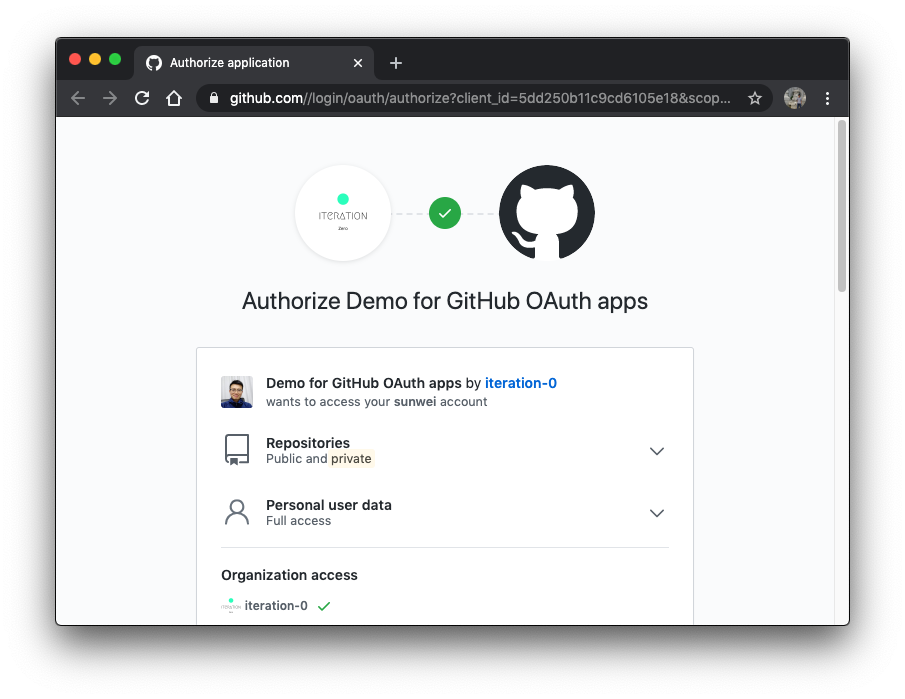
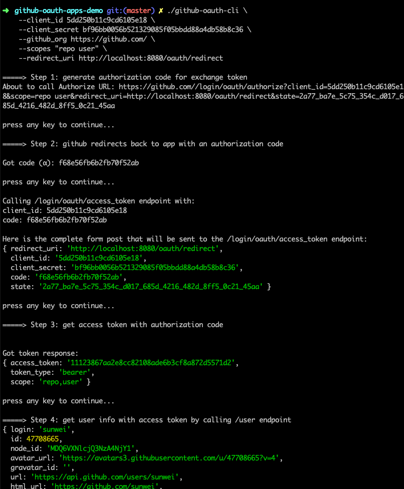

# github-oauth-apps-demo
Demo for GitHub OAuth apps with a command line tool

## Project Installation

    npm install

## GitHub OAuth app registration

Goto: User/Group settings, for example: `https://github.com/organizations/iteration-0/settings/applications`

## Usage Example

    ./github-oauth-cli \
    --client_id 5dd250b11c9cd6105e18 \
    --client_secret bf96bb0056b521329085f05bbdd88a4db58b8c36 \
    --github_org https://github.com/ \
    --scopes "repo user" \
    --redirect_uri http://localhost:8080/oauth/redirect

### GitHub user authorization 

### Complete process

## Reference

* [GitHub Developer OAuth Apps](https://developer.github.com/apps/building-oauth-apps/authorizing-oauth-apps/)
